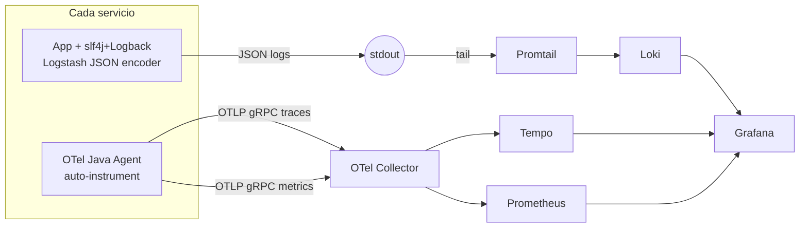

# 0006. Adoptar slf4j + Logback JSON, OpenTelemetry Java Agent y Collector central como baseline de observabilidad

- **Status:** Accepted
- **Date:** 2026-06-12
- **Deciders:** @nwnorowsky

## Contexto

El stack objetivo del proyecto (`docs/README.md`) ya nombra **Tempo + Prometheus + Loki + Grafana + OpenTelemetry** como infraestructura de observabilidad. Lo que falta es decidir **cómo** llegan los datos desde cada servicio Java hasta esa visualización, y qué disciplina de logging es ley desde el primer commit.

Las fuerzas en juego:

- **Microservicios distribuidos.** Una request del usuario cruza N servicios; sin correlation IDs es imposible reconstruir qué pasó. La elección debe propagar trace context (W3C `traceparent`) por HTTP, gRPC metadata y headers Kafka automáticamente.
- **Mezcla Spring + Quarkus.** El stack default es Spring Boot, con `notifications` en Quarkus (ver `docs/README.md`). La solución tiene que funcionar idéntica en ambos.
- **Hexagonal con dominio puro (`0005`).** Logging es infraestructura cross-cutting; la decisión no debe ensuciar el dominio con dependencias o anotaciones de framework.
- **Compose primero, K8s diferido (`0003`).** No vamos a poder asumir DaemonSets, sidecars, ni operators. El pipeline tiene que funcionar con Docker Compose nativo y migrar limpio a K8s en Phase 6 si llega.
- **Una persona aprendiendo.** Cualquier solución que requiera código de observability en cada servicio quema tiempo desproporcionado en Fase 1. Buscar zero-code por default, con escape hatch para custom cuando se necesite.
- **`melown.java-base` (`0004`).** Es el lugar natural para agregar las dependencias compartidas de logging. Cada servicio no debería tener que configurar Logback desde cero.
- **PII / secrets en logs.** En microservicios serios (compañías tipo MercadoLibre), loguear un password o un token completo es un incidente de seguridad. La política tiene que estar en el ADR, no en el wiki interno que nadie lee.

## Decisión

Adoptar el siguiente baseline de observabilidad, aplicable a todos los servicios (Spring y Quarkus):

### Stack

- **Logging:** slf4j como façade + Logback como backend + **Logstash Logback Encoder** para serialización JSON a stdout.
- **Tracing & metrics:** **OpenTelemetry Java Agent** (`-javaagent:opentelemetry-javaagent.jar`) — auto-instrumentación zero-code de Spring Boot, JDBC, gRPC, Kafka, HTTP clients, Quarkus.
- **Pipeline:** servicios exportan trazas y métricas vía **OTLP gRPC** a un **OpenTelemetry Collector central**, que hace fanout a Tempo (trazas) y Prometheus (métricas). Logs se escriben a stdout en JSON; **Promtail** los recolecta de los containers y los publica a Loki.
- **Visualización:** Grafana con datasources de Tempo, Prometheus y Loki configuradas.

### Diagrama de flujo



### Campos JSON por log line

Cada log line emitida en JSON contiene como mínimo:

| Campo | Origen | Ejemplo |
|---|---|---|
| `@timestamp` | Automático (ISO 8601 con offset) | `2026-06-12T14:23:11.345Z` |
| `level` | Logback | `INFO`, `WARN`, `ERROR` |
| `logger` | FQN de la clase | `com.melown.catalog.application.usecase.CreateProductService` |
| `message` | El mensaje del log | `"Product created"` |
| `service.name` | Env var / app property | `catalog` |
| `service.version` | Build metadata | `0.1.0` |
| `trace_id` | MDC, poblado por OTel agent | `4bf92f3577b34da6a3ce929d0e0e4736` |
| `span_id` | MDC, poblado por OTel agent | `00f067aa0ba902b7` |
| `trace_flags` | MDC, poblado por OTel agent | `01` |
| `thread` | Logback | `http-nio-8080-exec-3` |

A esto se suman los campos MDC que el código ponga explícitamente: `user_id`, `order_id`, `request_id`, `idempotency_key`, etc.

### Configuración del OTel Java Agent

Cada servicio levanta con el agent inyectado vía Dockerfile. Variables de entorno por servicio:

```
OTEL_SERVICE_NAME=catalog
OTEL_EXPORTER_OTLP_ENDPOINT=http://otel-collector:4317
OTEL_EXPORTER_OTLP_PROTOCOL=grpc
OTEL_TRACES_SAMPLER=parentbased_traceidratio
OTEL_TRACES_SAMPLER_ARG=1.0        # dev local; 0.1 en prod-like
OTEL_LOGS_EXPORTER=none             # logs van por stdout, no por OTLP
OTEL_METRICS_EXPORTER=otlp
OTEL_RESOURCE_ATTRIBUTES=service.version=0.1.0,deployment.environment=local
```

El agent se descarga al image build y se referencia desde el `ENTRYPOINT`:

```dockerfile
ENTRYPOINT ["java", "-javaagent:/opt/opentelemetry-javaagent.jar", "-jar", "/app/app.jar"]
```

### OTel Collector como pieza central

El Collector corre como un container más en el `docker-compose.yml`. Configuración mínima:

```yaml
receivers:
  otlp:
    protocols:
      grpc:
        endpoint: 0.0.0.0:4317

processors:
  batch:
  resource:
    attributes:
      - key: deployment.environment
        value: local
        action: insert

exporters:
  otlp/tempo:
    endpoint: tempo:4317
    tls:
      insecure: true
  prometheus:
    endpoint: 0.0.0.0:8889

service:
  pipelines:
    traces:
      receivers: [otlp]
      processors: [batch, resource]
      exporters: [otlp/tempo]
    metrics:
      receivers: [otlp]
      processors: [batch, resource]
      exporters: [prometheus]
```

Prometheus scrapea el endpoint del Collector. Tempo recibe vía OTLP gRPC directo.

### Sampling

- **Dev local (Compose):** 100% de las trazas (`OTEL_TRACES_SAMPLER_ARG=1.0`). En aprendizaje queremos ver todo.
- **Prod-like (Phase 5 con Compose en Oracle Cloud):** 10% por default (`0.1`), configurable via env var.
- Sampling **head-based** (en el productor, decidido al inicio de la traza). Es lo que soporta el agent out of the box.
- Tail-based sampling (decisión en el collector después de ver toda la traza) queda fuera de scope — más complejo, requiere más memoria en el collector. Si en Phase 4 aparece la necesidad real (capturar todas las trazas de error aunque el sample global sea 10%), abrimos ADR nuevo.

### Política de "qué NO loguear" (ley desde Fase 1)

**Nunca, bajo ninguna circunstancia, en ningún nivel de log:**

- Passwords (hashed o plain).
- JWT access tokens o refresh tokens completos.
- Números de tarjeta de crédito completos. CVV. Fechas de vencimiento.
- Números de documento de identidad completos.
- Cualquier secret de Vault / variables de entorno marcadas como secret.

**Permitido con cuidado (redacción/hash):**

- Emails: redactar a formato `f***@dominio.com` o hashear con SHA-256 antes de loguear.
- Tokens para debugging: solo los primeros 8 chars (`eyJhbGciO...`) más la longitud total.
- Identificadores numéricos públicos (orderId, productId): OK sin transformar.

**Mecanismo de aplicación:**

- Las clases relevantes (`User`, `PaymentMethod`, `Token`) **no implementan `toString()` de forma trivial** — sobreescriben para redactar campos sensibles.
- `libs/observability` (módulo Gradle ya planeado en `0004`) provee helpers de sanitización (`Sanitizer.redactEmail()`, `Sanitizer.hashToken()`).
- Eventualmente (Fase 4 o cuando aparezca un incidente), se evalúa agregar una regla ArchUnit que prohíba pasar objetos de ciertas clases directo a `logger.info(...)`. Por ahora es disciplina de PR.

### Convention plugin integration

`melown.java-base` (definido en `0004`) extiende con:

- Dependencia `net.logstash.logback:logstash-logback-encoder` (lookup via version catalog).
- Para servicios Quarkus: exclude de JBoss Logging + add `slf4j-jboss-logmanager` para que Quarkus use slf4j façade.
- Resource `logback-spring.xml` base servido vía classpath desde `:libs:observability`.
- Cada servicio puede tener su propio `logback-spring.xml` que `<include>` el base y agrega overrides puntuales (loggers específicos del dominio, niveles custom).

Niveles por default:

- Root: `INFO`.
- `org.hibernate.SQL`: `WARN` (ruidoso).
- `org.apache.kafka.clients.NetworkClient`: `WARN` (ruidoso).
- `org.springframework.web`: `INFO`.
- Cualquier paquete del dominio del proyecto: `INFO` por default.

`DEBUG` se activa per-package via env var `LOGGING_LEVEL_COM_MELOWN_CATALOG=DEBUG`, nunca via commits a `logback-spring.xml`.

## Consecuencias

### Positivas

- **Zero-code observability en Fase 1.** El Agent auto-instrumenta sin escribir una línea de código en los servicios. Cuando hace falta un span custom para una operación de negocio, se agrega ahí — focal, no cross-cutting.
- **`trace_id` en cada log line** habilita el salto de Loki → Tempo gratis: clic en un log de error, Grafana abre la traza completa. Es la diferencia entre observabilidad real y "tengo logs y trazas".
- **Stack consistente con el resto del proyecto.** OTel + Grafana + Loki + Tempo + Prometheus son piezas que se integran sin custom glue code. Documentación abundante.
- **Vendor-neutral.** Logstash encoder y OTel no atan a Elastic ni a Datadog ni a New Relic. Migrar el destino de visualización en el futuro = cambiar config del Collector, no de los servicios.
- **Funciona idéntico en Spring y Quarkus.** El agent es agnóstico de framework JVM.
- **Política "qué NO loguear" como ley desde Fase 1.** Evitar incidentes de seguridad antes que tener que arreglarlos.
- **Coherente con `0003` (Compose-first).** Stdout → Promtail no requiere sidecars ni operators; migra limpio a K8s en Phase 6 (los Pods stdout van directo a la API de logs de K8s).

### Negativas

- **Overhead del Java Agent.** ~5-10% throughput en cargas web típicas. Marginal pero real. Lo pagamos por simplicidad. Cuando un servicio sufra performance issues atribuibles al agent, migrar esa pieza a SDK puntual.
- **JSON en `docker logs` es ilegible.** Para debugging ad-hoc en la terminal, leer JSON crudo cuesta. Mitigación: `docker logs <svc> | jq` localmente, o ir directo a Grafana/Loki para queries serias.
- **OTel Collector es un container más.** Suma operativa en Compose. A cambio: un solo endpoint que cada servicio conoce.
- **Customizar atributos via agent es más limitado que via SDK.** Si querés agregar `melown.business_event=ProductCreated` como atributo de span, el agent lo soporta vía system properties pero el SDK lo hace más limpio.
- **MDC y virtual threads / WebFlux.** Si Fase 2-3 introduce virtual threads o Project Reactor, MDC no se propaga automáticamente entre threads — hay que usar `ContextSnapshot` (Micrometer). Phase 1 con Spring Boot 3 + `@RequestMapping` plano no se pega con esto.
- **Política de "no loguear PII" depende de disciplina humana** hasta que tengamos ArchUnit rules más afinadas o linting. Riesgo de incidente real si el equipo crece.
- **Si el Collector se cae, telemetría se pierde.** El agent no tiene buffering persistente. Mitigación: el Collector raramente se cae en Compose local; en prod-like se le ponen restart policies y eventualmente HA.

### Riesgos a vigilar

- **Auto-instrumentación no es 100% completa.** Operaciones de negocio (ej: "Saga step completed") no aparecen como spans propios — solo aparecen las llamadas técnicas (DB, Kafka). Hay que agregar spans explícitos para los momentos de negocio importantes, vía la SDK incrustada en el agent (`@WithSpan` annotation funciona).
- **Drift del `logback-spring.xml` entre servicios.** Si cada servicio toca su archivo, las configs divergen. Mitigación: convention plugin + base config compartida; cualquier override que aparezca en 2+ servicios sube al base.
- **Volumen de logs.** JSON es más verboso que texto. A 100 req/s con logs INFO completos, el volumen crece rápido. Mitigación: niveles agresivos en frameworks ruidosos (Hibernate, Kafka clients) por default; eventualmente sampling de logs si aparece presión real.
- **Falsa sensación de "tenemos observabilidad porque corre el agent."** El agent te da los datos; la disciplina de qué loguear, cómo dashboards, qué alertas, sigue siendo trabajo humano. No confundir tooling con práctica.

## Alternativas consideradas

### Alternativa A: Log4j 2 en vez de Logback

Usar Log4j 2 como backend de slf4j por su performance edge.

**Por qué perdió:**
- Spring Boot trae Logback por default; cambiar requiere excludes en cada `build.gradle.kts`.
- Performance edge de Log4j 2 es marginal en cargas que no son log-bound.
- La historia de CVEs de Log4j 2 (Log4Shell, 2021) dejó cicatriz en la percepción de la industria, aun con patches.
- Ecosistema de appenders y encoders está más maduro en Logback (Logstash encoder es el referente del mercado).

### Alternativa B: ECS Encoder (Elastic Common Schema) en vez de Logstash Encoder

Usar el encoder oficial de Elastic con su schema canónico.

**Por qué perdió:**
- ECS define field names específicos del vocabulario Elastic (`host.os.name`, `event.kind`, etc.). Atrae si vas hacia ELK; nada si no.
- Logstash encoder es vocabulario-neutro y dominante fuera de deployments ELK.
- Nuestro stack es Loki + Grafana, no Elastic. ECS sería over-fitting.

### Alternativa C: OpenTelemetry SDK desde día uno (sin Agent)

Configurar OTel programáticamente en cada servicio: instanciar tracer, meter providers, exporters, samplers.

**Por qué perdió:**
- Boilerplate significativo por servicio (~100 líneas de wiring inicial).
- Para Phase 1 el Agent da el 80% del valor con el 5% del esfuerzo.
- La salida correcta cuando aparece la necesidad puntual es migrar la pieza específica a SDK, no anticipar la complejidad para todo.
- Sr/Staff defendible: "pragmáticamente eligió zero-code para arrancar y dejó la puerta abierta para refinar".

### Alternativa D: Exporters directos por servicio (sin OTel Collector)

Cada servicio configura un exporter por destino (Tempo, Prometheus, Loki).

**Por qué perdió:**
- Cada servicio conoce 3 endpoints distintos en lugar de 1 — más config en cada deploy.
- Migrar el stack de visualización (ej: cambiar Tempo por Jaeger) requiere tocar cada servicio.
- El Collector centraliza routing, batching, sampling, transformación. Una pieza más, pero su valor aparece desde el segundo servicio.

### Alternativa E: Logging en texto plano en vez de JSON

`%d{ISO8601} %-5level [%thread] %logger{36} - %msg%n`

**Por qué perdió:**
- Imposible queries estructuradas en Loki (`{level="ERROR"} |= "OrderPlaced"` sigue funcionando pero `| json` + `| order_id="..."` no).
- Estándar de industria para sistemas distribuidos es structured logging.
- El argumento "más fácil de leer en la terminal" solo aplica a sistemas con un solo binario; en microservicios mirás Grafana, no `docker logs`.

### Alternativa F: Tail-based sampling en el Collector

El Collector recibe la traza completa, decide si la guarda según criterios (error, latencia alta, etc.).

**Por qué perdió:**
- Más memoria en el Collector (tiene que retener spans hasta saber si la traza es interesante).
- Configuración más compleja.
- Head-based sampling alcanza para Phase 1-5. Si en Phase 4 aparece la necesidad real de capturar 100% de los errores aunque el sample global sea bajo, abrimos ADR.

### Alternativa G: ELK (Elasticsearch + Logstash + Kibana) en vez de LGT (Loki + Grafana + Tempo)

Stack alternativo de visualización.

**Por qué perdió:**
- README ya decidió Grafana + Loki + Tempo. No reabrimos.
- Loki es más liviano (label-based, no full-text) → mejor para Compose local.
- Grafana unifica métricas (Prometheus), logs (Loki) y trazas (Tempo) en una sola UI.

## Referencias

- ADR `0001` — Avro para Kafka (los eventos también atraviesan el pipeline observability via spans del agent).
- ADR `0003` — K8s diferido (esta arquitectura es Compose-nativa).
- ADR `0004` — Layout del monorepo Gradle (`:libs:observability` aloja la config compartida).
- ADR `0005` — Hexagonal (logging vive en infrastructure, no en domain).
- [OpenTelemetry Java Agent](https://github.com/open-telemetry/opentelemetry-java-instrumentation).
- [OpenTelemetry Collector](https://opentelemetry.io/docs/collector/).
- [Logstash Logback Encoder](https://github.com/logfellow/logstash-logback-encoder).
- [Grafana Loki best practices](https://grafana.com/docs/loki/latest/best-practices/).
- [W3C Trace Context](https://www.w3.org/TR/trace-context/).
- ADR pendiente: política de "data classification / PII" formal (puede extender o desplazar la sección de "qué NO loguear" de este ADR cuando llegue Phase 4).
