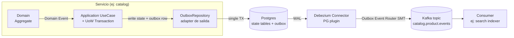

# 0007. Adoptar Patrón Outbox + CDC con Debezium como mecanismo único de publicación de eventos

- **Status:** Accepted
- **Date:** 2026-06-14
- **Deciders:** @nwnorowsky

## Contexto

`CLAUDE.md` ya declara como **regla dura** del proyecto: *"Patrón Outbox para toda escritura que produce evento. Nunca publicar a Kafka y escribir la DB como operaciones separadas."* La regla existe sin un ADR que la sustente — es la única ley del proyecto que vive como afirmación huérfana. Este ADR la formaliza y, sobre todo, decide **cómo** se implementa el outbox: el patrón en sí (escribir a tabla en la misma transacción que el estado) admite dos familias de implementación muy distintas (polling propio vs CDC) cuya elección no es obvia.

Las fuerzas en juego:

- **Problema de la doble escritura.** Cuando una operación de negocio cambia estado y produce un evento, hay dos sistemas que se tienen que actualizar atómicamente: la DB del servicio y el broker. Postgres y Kafka **no comparten transacción**. Cualquiera de las dos órdenes deja una ventana de fallo:
  - `DB.commit()` → crash → `kafka.send()` nunca corre. El estado quedó cambiado, el resto del sistema no se entera. Pago confirmado en `payments` que `orders` nunca recibe.
  - `kafka.send()` → crash → `DB.commit()` rollback. Consumidores reaccionan a un evento que no existió. `inventory` reservó stock para una orden que nunca se creó.
  - Cualquier solución que no resuelva esto **no es opción** en un sistema que pretende ser "production-ready". No es paranoia: es lo que se rompe en producción real bajo carga.
- **Stack ya decidido upstream.** ADR `0001` fijó Avro + Schema Registry como contrato de eventos en Kafka. ADR `0006` fijó OTel + W3C `traceparent` como contexto que debe sobrevivir el salto sync→async. Cualquier outbox tiene que (a) producir bytes Avro válidos en Kafka, y (b) propagar `traceparent` a través del salto async para que la traza no se rompa.
- **Postgres por servicio + Compose-first.** Cada servicio tiene su propia Postgres (regla #1 de `CLAUDE.md`), y el entorno default es Docker Compose hasta Phase 6 (ADR `0003`). La solución tiene que correr como uno o dos containers más, sin operators ni mesh.
- **Una persona aprendiendo.** Implementar un poller propio + scheduler + lease + dead-letter es ~500 LoC de infraestructura per service. Aprender Debezium es ~1 archivo de config por servicio + entender CDC una vez. El segundo camino enseña más sobre cómo trabajan los sistemas distribuidos reales (WAL, logical replication, at-least-once).
- **Mezcla Spring + Quarkus.** `notifications` corre en Quarkus (ver `docs/README.md`). La solución no puede ser un módulo Spring-only; tiene que ser **infraestructura externa al servicio**, no librería embebida.
- **Hexagonal (ADR `0005`).** El dominio no se entera de Kafka. La publicación de eventos es un adapter de salida; el dominio dispara *Domain Events*, el adapter los persiste en la tabla outbox dentro de la transacción del UoW. CDC vive afuera del proceso del servicio — es lo más cercano al dominio puro que existe.
- **Fase 1 ya incluye un evento desde `catalog`.** El primer `INSERT` que produzca un evento Kafka del proyecto va a tocar este patrón. Mejor decidirlo antes de escribir el primer producer.

## Decisión

Adoptar **Outbox transaccional + CDC con Debezium** como el único mecanismo de publicación de eventos a Kafka en todo el sistema. Ningún servicio llama `KafkaProducer.send()` directamente: el dominio escribe a una tabla `outbox` en la misma transacción que el cambio de estado, y un cluster central de **Kafka Connect con Debezium PostgreSQL Connector** lee el WAL de cada Postgres y publica los eventos a sus topics correspondientes.

### Diagrama de flujo



### Componentes

#### 1. Tabla `outbox` por servicio

Cada servicio tiene **exactamente una** tabla outbox en su Postgres. Schema mínimo:

```sql
CREATE TABLE outbox (
    id              UUID        PRIMARY KEY,
    aggregate_type  VARCHAR(64) NOT NULL,   -- ej: "Product", "Order"
    aggregate_id    VARCHAR(64) NOT NULL,   -- ej: el productId o orderId
    event_type      VARCHAR(64) NOT NULL,   -- ej: "ProductCreated", "OrderPlaced"
    payload         BYTEA       NOT NULL,   -- Avro-serialized bytes (incluye SR magic byte + schema id)
    traceparent     VARCHAR(64),            -- W3C trace context capturado del MDC
    tracestate      TEXT,                   -- W3C tracestate (opcional, multi-vendor)
    created_at      TIMESTAMPTZ NOT NULL DEFAULT now()
);
```

El `id` UUID es la **idempotency key** que viaja como header de Kafka (`event_id`) y permite a los consumers deduplicar.

#### 2. Estrategia INSERT-then-DELETE en la misma transacción

Cada use case escribe la fila outbox y la borra acto seguido — todo en la misma transacción:

```sql
BEGIN;
  -- cambio de estado del agregado
  INSERT INTO product (id, name, sku, ...) VALUES (...);

  -- evento outbox
  INSERT INTO outbox (id, aggregate_type, aggregate_id, event_type, payload, traceparent)
    VALUES ('uuid', 'Product', 'pid', 'ProductCreated', E'\\x...', '00-...-...-01');
  DELETE FROM outbox WHERE id = 'uuid';
COMMIT;
```

Lo crítico: **el WAL captura ambas operaciones** (INSERT + DELETE) aunque la tabla termine vacía. Debezium lee del WAL, no de la tabla, así que el evento se publica de todos modos. La tabla queda permanentemente vacía → cero bloat, cero VACUUM agresivo, cero job de limpieza. Es el patrón explícitamente recomendado por la documentación de Debezium.

Operacionalmente: si querés debuggear "¿qué evento se emitió?", la tabla no sirve — vas a Kafka, que es donde el evento realmente vive. Eso es coherente: la tabla outbox es un detalle de implementación del bridge DB→Kafka, no un log de auditoría. Para auditoría hay otros mecanismos (event log dedicado, Kafka topic con retención larga).

#### 3. Serialización Avro en el servicio, no en Debezium

El servicio serializa el evento usando el cliente de Schema Registry (`KafkaAvroSerializer` semantics — magic byte `0x00` + schema id de 4 bytes + payload Avro) y persiste **esos bytes** en la columna `payload BYTEA`. Debezium pasa los bytes tal cual a Kafka usando `ByteArrayConverter`. Schema Registry se consulta **solo desde el servicio** (cuando registra la nueva versión del schema), nunca desde el connector.

Esto preserva la línea de responsabilidades de ADR `0001`: el dueño del schema es el servicio productor. Debezium es un **pipe tonto** que no entiende el formato del payload — y eso es bueno: si mañana cambiamos de Avro a Protobuf en Kafka (no va a pasar, pero), Debezium no se entera.

#### 4. Outbox Event Router SMT de Debezium

Debezium provee una Single Message Transform específica para este patrón: `EventRouter`. Configurada por conector:

```json
{
  "transforms": "outbox",
  "transforms.outbox.type": "io.debezium.transforms.outbox.EventRouter",
  "transforms.outbox.table.field.event.id": "id",
  "transforms.outbox.table.field.event.key": "aggregate_id",
  "transforms.outbox.table.field.event.type": "event_type",
  "transforms.outbox.table.field.event.payload": "payload",
  "transforms.outbox.route.by.field": "aggregate_type",
  "transforms.outbox.route.topic.replacement": "${routedByValue}.events",
  "transforms.outbox.table.fields.additional.placement": "traceparent:header,tracestate:header,event_type:header"
}
```

Esto resuelve, declarativamente:

- **Routing por agregado:** `aggregate_type = "Product"` → topic `Product.events` (o `catalog.product.events` con un naming policy más prolijo).
- **Particionado:** clave del mensaje = `aggregate_id` → ordering garantizado por agregado (todos los eventos de `productId=X` caen en la misma partición y respetan orden de emisión).
- **Headers Kafka:** `traceparent`, `tracestate`, `event_type` van como headers, no como parte del payload Avro. El consumer los lee sin deserializar el evento.
- **Filtrado de tombstones:** los DELETE generados por el patrón INSERT-then-DELETE son ignorados por el SMT (configurable; por default reacciona solo a operaciones de tipo `c` = create).

#### 5. Postgres: setup de logical replication

Cada Postgres del proyecto arranca con configuración compatible con CDC:

```ini
# postgresql.conf
wal_level = logical
max_wal_senders = 10
max_replication_slots = 10
```

Debezium usa el plugin nativo `pgoutput` (no `wal2json` ni `decoderbufs` — son alternativas legacy o que requieren build custom de la imagen). `pgoutput` viene con Postgres ≥ 10 out-of-the-box, sin extensiones.

Por cada servicio, el connector crea (o se le declara):

- Una **publication** Postgres (`CREATE PUBLICATION outbox_pub FOR TABLE outbox;`) — limita a Debezium a leer solo la tabla outbox, no toda la DB.
- Un **replication slot** lógico (`outbox_slot`). El slot retiene WAL hasta que Debezium lo consuma. Si Debezium se cae por mucho tiempo, el WAL se acumula → riesgo operativo (ver "Riesgos a vigilar").

#### 6. Kafka Connect cluster centralizado

Un solo cluster de Kafka Connect en `distributed mode` corre en Compose, con N connectors registrados — uno por servicio que produce eventos. Razones de centralizar (vs un Connect por servicio):

- Un solo lugar donde verificar el estado de los conectores (`GET /connectors/.../status`).
- Una sola UI de monitoring (Conduktor / Confluent Control Center / Kafka UI).
- Workers compartidos = menos overhead de JVMs en Compose.

Costo: si el cluster Connect se cae, **todos** los servicios dejan de propagar eventos. Mitigación en Phase 4 (resiliencia): correr 2+ workers Connect y restart policies. En Phase 1 alcanza con un worker.

#### 7. Propagación de trace context end-to-end

El flujo completo de `traceparent`:

1. Request HTTP entra al gateway → OTel agent (ADR `0006`) crea span root y pone `traceparent` en el contexto.
2. Llamada gRPC a `catalog` → agent inyecta `traceparent` en metadata gRPC; del lado de `catalog` el agent extrae y restablece el contexto + MDC.
3. Use case de `catalog` ejecuta. Antes de escribir la fila outbox, el adapter lee `MDC.get("traceparent")` y lo persiste como columna.
4. Debezium SMT mueve la columna a un header Kafka `traceparent`.
5. Consumer (ej: `search` indexer) recibe el record, OTel agent extrae el header → continúa la traza con un span "linked" (semantic convention: `messaging.consume`).

El resultado: en Grafana/Tempo se ve una sola traza de extremo a extremo aunque haya un salto async de varios segundos en el medio. **Sin este detalle, ADR `0006` queda parcialmente roto en el path async.**

#### 8. Naming de topics y particionado

- **Naming convention:** `<servicio>.<aggregate>.events` (todo lowercase, con punto). Ej: `catalog.product.events`, `orders.order.events`, `payments.payment.events`.
- **Particionado:** clave = `aggregate_id`. Esto garantiza orden **por agregado**, no global. Es el contrato más fuerte que se puede dar en sistemas distribuidos sin perder throughput.
- **Retención:** 7 días por default en Phase 1 (suficiente para debugging y replay de consumers nuevos); ajustable por topic.

#### 9. Convention en el código del servicio (referencia, no parte de la decisión)

`libs/outbox` (módulo Gradle planeado bajo ADR `0004`) expone:

- `OutboxRepository` — port hexagonal: `record OutboxEvent(UUID id, String aggregateType, String aggregateId, String eventType, byte[] payload, String traceparent) {}` + `void append(OutboxEvent e)`.
- Implementación JDBC default que hace el INSERT + DELETE atómico.
- Integración con MDC para capturar `traceparent` automáticamente.
- Integración con el `KafkaAvroSerializer` de Confluent para producir bytes desde un objeto Avro generado.

Esto evita que cada servicio reimplemente la mecánica. La aplicación solo dice "append este evento de dominio".

### Imagen y versiones (referencia)

- Debezium **3.x** (línea actual, Apache 2.0, mantenida por Red Hat) sobre Kafka Connect.
- Connector: `debezium-connector-postgres`.
- Schema Registry: Confluent CP **7.x** (Community Edition) o **Karapace** (Aiven, fully Apache 2.0) si querés evitar la Confluent Community License. Decisión específica de SR queda fuera de scope acá — la cubre ADR `0001` o un ADR de infra de eventos.

## Consecuencias

### Positivas

- **Doble escritura imposible por construcción.** No hay forma de publicar a Kafka sin antes haber escrito (y commiteado) en la DB. El bug clásico de microservicios queda eliminado, no mitigado.
- **El dominio no conoce a Kafka.** Coherente con hexagonal (ADR `0005`): el use case escribe a un port abstracto (`OutboxRepository`), no a un producer Kafka. Testing de unidad del dominio queda libre de mocks de Kafka.
- **Aprendizaje real de CDC.** WAL, logical replication, replication slots, plugin `pgoutput`, Connect en distributed mode — son piezas que vas a encontrar en cualquier sistema de datos serio. Inversión educacional alta.
- **Trace context end-to-end.** La traza sobrevive el salto async sin código de boilerplate en cada servicio. Sin esto, ADR `0006` queda incompleto.
- **At-least-once garantizado.** Si Kafka rechaza un publish, Debezium reintenta desde el offset del slot. Nunca se pierde un evento confirmado en DB.
- **Schema evolution centralizada.** ADR `0001` ya cubre evolución Avro forward/backward compatible. Esta decisión no le agrega complejidad — al revés, refuerza que SR es el único punto de validación de schemas.
- **Compose-nativo.** Debezium + Connect son containers más. Migra a Phase 6 (K8s) sin tocar la decisión — Strimzi provee un operator de Connect, pero el patrón es idéntico.
- **Multi-framework.** Funciona idéntico para Spring (`catalog`, `orders`, etc.) y Quarkus (`notifications`). La diferencia se reduce a qué cliente JDBC y qué transaction manager usa cada framework — el patrón en sí no cambia.
- **Replay y bootstrapping de nuevos consumers gratis.** Si Phase 2 agrega el indexer de Elasticsearch, lee desde el principio del topic y reindexea todo sin tocar `catalog`. Pure CQRS read path.

### Negativas

- **Operativa significativa.** Kafka Connect cluster + N connectors + Postgres logical replication configurada + monitoring de slots. Más piezas en el `docker-compose.yml`. La curva inicial pesa.
- **Latencia mínima ~100ms–1s.** WAL → Debezium → Kafka no es síncrono. En idle es subsegundo; bajo carga puede crecer. **Si un caso de uso necesita ver el evento publicado de forma síncrona (raro, casi siempre es un anti-pattern), este modelo no sirve.** No conocemos ningún caso así en el dominio de Melown.
- **WAL bloat si Debezium cae.** El replication slot retiene WAL hasta que se consuma. Si Debezium está offline horas, el disco de Postgres se llena. **Riesgo operativo real.** Mitigación: monitoring del lag del slot (`pg_replication_slots`) + alertas. En Phase 4 entra como SLO explícito.
- **At-least-once = consumers deben ser idempotentes.** El mismo evento puede llegar dos veces (failover, rebalance, replay). Cada consumer debe implementar deduplicación por `event_id` (idempotency key). Esto se aplicaba igual sin Debezium pero queda más explícito acá.
- **Patrón INSERT-then-DELETE confunde a primera vista.** Devs nuevos van a preguntar "¿por qué la tabla está vacía si supuestamente guardamos eventos?". Mitigación: comentario en el schema + sección en `CLAUDE.md`. Es un costo de claridad por una ganancia operativa (zero VACUUM, zero job de limpieza).
- **Inicial snapshot puede ser caro.** Cuando un connector arranca contra una DB con muchos datos hace un snapshot inicial. Para `outbox` esto es trivial (tabla vacía siempre), pero si en el futuro alguien aplica Debezium a tablas de estado para otra cosa, hay que recordar este costo. No aplica al alcance de este ADR.
- **Ordering solo por agregado, no global.** Eventos de distintos `aggregate_id` pueden ser reordenados entre topics distintos. Hay que diseñar consumers asumiendo esto. Es la realidad de Kafka, no algo nuevo del outbox.
- **Acoplamiento al WAL de Postgres.** Si un servicio futuro quisiera migrar a otra DB (MongoDB, DynamoDB), el patrón cambia. Para MongoDB hay un connector Debezium (oplog); para Dynamo hay Streams. Pero la pieza específica de este ADR (`pgoutput`) es Postgres-only. Aceptado: ADR `0001` y ADR `0004` ya asumen Postgres como default.

### Riesgos a vigilar

- **Lag del replication slot.** Métrica crítica = `pg_replication_slots.confirmed_flush_lsn` vs `pg_current_wal_lsn`. Si el delta crece sin acotar, Debezium está colgado o degradado. Alert mandatorio desde Phase 4.
- **Schema drift de la tabla outbox.** Si un servicio agrega una columna nueva a `outbox` sin que el SMT lo sepa, los eventos viejos se siguen procesando pero los nuevos pueden romper. El schema de `outbox` es **parte del contrato de infraestructura**, no del dominio — change controlado.
- **Connector morboso (failure mode "stuck").** Debezium tiene patologías donde el connector reporta `RUNNING` pero no consume. Mitigación: monitoring del lag y heartbeat events (Debezium tiene una feature de heartbeat configurable).
- **Acoplamiento a Confluent Kafka.** Connect en distributed mode requiere Kafka como backend de offsets/configs. Si en el futuro consideramos Redpanda o Pulsar, la decisión hay que revisarla — pero ADR `0001` ya fijó Kafka.
- **Replay accidental.** Borrar un replication slot por error → al recrearlo, Debezium puede republicar todo el snapshot. Cualquier operación sobre slots tiene que ser deliberada y documentada.
- **Volumen de eventos.** WAL crece linealmente con writes. A 100 evt/s sostenidos sale ~8M/día. Debezium escala — pero monitoring del throughput y del lag es no-negociable.

## Alternativas consideradas

### Alternativa A: Doble escritura "ingenua" (DB + Kafka como operaciones separadas), aceptar la inconsistencia con retries

Escribir a DB, después llamar `kafkaProducer.send()`. Si falla, retry. Si retry agota, alertar.

**Por qué perdió:**
- No resuelve el problema. La ventana entre `DB.commit()` y `kafka.send()` siempre existe. Un crash de la JVM en el medio = inconsistencia silenciosa, no detectable.
- Retries no ayudan: si la JVM ya no existe, no hay nada que reintente.
- Es el anti-patrón explícito que este ADR quiere prevenir.

### Alternativa B: Transactional Outbox + Poller propio (sin CDC)

App escribe outbox row dentro de la transacción. Un scheduler (`@Scheduled` Spring o `cron4j`) hace `SELECT ... FOR UPDATE SKIP LOCKED` cada N ms y publica los rows pendientes a Kafka. Marca rows como published o los borra.

**Por qué perdió:**
- **Reinventa CDC manualmente.** Lo que en Debezium es declarativo (config JSON) acá es código de scheduler + lease + dead letter + retry + métricas + dashboard. Estimado: 400–800 LoC de infraestructura por *biblioteca compartida* + integración por servicio.
- **Latencia peor.** Polling lag = intervalo del scheduler. Para latencia subsegundo hay que pollear cada 100–200ms → carga constante sobre Postgres aunque no haya eventos. CDC consume el WAL en streaming.
- **No aprovecha el WAL.** Postgres ya tiene un mecanismo durable, ordenado, replicable, exactly-once-from-source para cambios — usarlo. Hacer polling es bypass de la mejor herramienta disponible.
- **Pierde valor educativo.** Aprender CDC (WAL, logical replication, slots, plugin `pgoutput`) es transferible a cualquier sistema serio. Aprender un polling propio enseña scheduling, no sistemas distribuidos.
- **Spring Modulith** tiene una variante de esto (`@ApplicationModuleListener` + `event-publication-registry`). Es elegante en mono-modulith, pero no resuelve el cruce de límite hacia Kafka — sigue habiendo doble escritura entre la tabla de event-publication y el broker.

Vale la pena nombrar dónde *sí* tiene sentido el poller propio: equipos pequeños sin DBA dedicado, sin Connect cluster operativo, con presupuesto operativo cero. Para un proyecto que **ya** tiene Kafka como parte central, Connect es marginal.

### Alternativa C: Postgres LISTEN/NOTIFY como bridge

App escribe outbox row + `NOTIFY outbox_channel, '<id>'`. Un listener Java (`PGConnection.getNotifications()`) recibe la notificación y publica a Kafka.

**Por qué perdió:**
- **NOTIFY no es durable.** Si el listener está caído cuando se emite la notificación, el evento se pierde a nivel notify (la fila en outbox sigue, pero nada la dispara hasta el próximo NOTIFY de otro evento).
- **Sin offset / sin replay.** No hay forma de decirle "dame los eventos desde la posición X". WAL/Debezium sí.
- **Payload limitado a 8000 bytes.** Trivial, pero un detalle más.
- **No hay backpressure ni batching.** Cada NOTIFY dispara un round-trip. Bajo carga, performance peor que polling batched.
- En el mundo Postgres, LISTEN/NOTIFY es para casos de **invalidación de cache** o coordinación liviana — no para mensajería confiable.

### Alternativa D: Kafka Connect JDBC Source Connector (en lugar de Debezium)

Connector oficial de Confluent que ejecuta queries SQL periódicas (`SELECT * FROM outbox WHERE id > last_id`) y publica resultados a Kafka.

**Por qué perdió:**
- **Es polling, no CDC.** Misma desventaja de latencia que Alternativa B, pero administrada por Connect en lugar de por la app. No aprovecha el WAL.
- **Requiere columna monotónica/timestamp** para detectar nuevos rows. Eso acopla el schema de outbox al modo de detección.
- **No captura DELETE/UPDATE intermedios** — solo el estado final. En outbox no importa porque solo hacemos INSERT, pero limita las opciones futuras.
- **Para Postgres existe Debezium que es estrictamente mejor.** JDBC Source tiene su nicho cuando la DB no soporta CDC (algunos legacy systems); Postgres lo soporta.

### Alternativa E: Spring Modulith `event-publication-registry`

Spring Modulith implementa un mini-outbox interno: cuando un `@ApplicationModuleListener` recibe un event, se persiste en una tabla `event_publication` hasta que el listener confirma. Retry automático.

**Por qué perdió:**
- **Solo Spring.** Quarkus `notifications` queda afuera. Toda la decisión arquitectónica del proyecto enfatiza "stack multi-framework" — adoptar una decisión Spring-only contradice eso.
- **No cruza a Kafka.** Resuelve eventos *internos* dentro del proceso Spring (entre módulos del mismo monolito modular). El cruce DB→Kafka sigue siendo doble escritura.
- **Acoplamiento al framework.** El día que un servicio quiera moverse fuera de Spring (cosa que no pasa en este proyecto, pero el principio aplica), todo el patrón de eventos se rompe.

### Alternativa F: XA / 2PC entre Postgres y Kafka

Transacción distribuida con un Transaction Manager que coordine commit en ambas.

**Por qué perdió:**
- **Kafka no soporta XA.** Punto. No hay TM que pueda enrolar al broker como recurso XA.
- **Aunque lo soportara, 2PC en cloud-native está muerto** — el coordinador es SPOF y los locks distribuidos no escalan. Esta visión va a quedar formalizada en el ADR futuro sobre Saga vs 2PC.
- Mencionarlo solo para descartar explícitamente: nadie debería preguntarse "¿por qué no XA?" después de leer este ADR.

### Alternativa G: Event Sourcing puro (sin outbox)

El estado del agregado **es** el log de eventos. No hay "tabla de estado + outbox", solo un append-only log de eventos. Postgres + un `event_store` table + projecciones derivadas.

**Por qué perdió (para esta decisión)**:
- **Cambio de paradigma masivo.** Todos los servicios pasarían de stateful CRUD a event-sourced. Muy lejos del objetivo de Fase 1.
- **Phase 7 stretch lo contempla para `orders`** como ejercicio aislado. Eso está bien — un servicio event-sourced rodeado de servicios state-stored es realista y enseña la convivencia.
- **Outbox + state-stored es el camino industrial mainstream.** ES puro existe en nichos (sistemas de trading, contabilidad, auditoría regulatoria), no como default.

### Alternativa H: Maxwell

CDC alternativo a Debezium.

**Por qué perdió:**
- **Solo MySQL.** No aplica a nuestro stack Postgres. Mencionado por completitud.

### Alternativa I: Un Debezium *embedded* en cada servicio (Debezium Engine)

Debezium provee un modo "embedded" como librería: la app misma corre el connector dentro de su JVM y publica a Kafka.

**Por qué perdió:**
- **Acopla operativa al ciclo de vida del servicio.** Si el servicio reinicia, el connector reinicia, el slot se vuelve a tomar — más complejidad de coordinación, sobre todo con múltiples réplicas (Phase 6).
- **Vuelve a Spring-only / Quarkus-only** según cómo se integre. La forma standalone (Kafka Connect cluster) es framework-neutral.
- **Tiene su nicho** cuando no querés un Kafka Connect cluster: edge devices, jobs batch, ETL standalone. Para un sistema con Connect ya presente, no agrega valor.

## Referencias

- ADR `0001` — Protobuf + Avro: define el formato de los bytes que viajan en la columna `payload`.
- ADR `0002` — gRPC interno: el `traceparent` viene en metadata gRPC desde el caller; este ADR lo persiste hasta el header Kafka.
- ADR `0003` — K8s diferido: Compose-first influye en preferir un único Connect cluster vs un sidecar por servicio.
- ADR `0004` — Monorepo Gradle: `libs/outbox` es el módulo natural para las abstracciones compartidas.
- ADR `0005` — Hexagonal: `OutboxRepository` es un adapter de salida; el dominio no conoce Kafka ni Debezium.
- ADR `0006` — Observability baseline: la propagación de `traceparent` por la tabla outbox cierra el path async para tracing end-to-end.
- [Pattern: Transactional Outbox — Chris Richardson, microservices.io](https://microservices.io/patterns/data/transactional-outbox.html).
- [Debezium Outbox Event Router SMT](https://debezium.io/documentation/reference/stable/transformations/outbox-event-router.html).
- [Reliable Microservices Data Exchange With the Outbox Pattern — Gunnar Morling (Debezium)](https://debezium.io/blog/2019/02/19/reliable-microservices-data-exchange-with-the-outbox-pattern/).
- [Postgres logical replication](https://www.postgresql.org/docs/current/logical-replication.html).
- [Apache Kafka Connect](https://kafka.apache.org/documentation/#connect).
- ADRs pendientes que tocan esta área: Saga vs 2PC (Phase 3) usará outbox como mecanismo de emisión de comandos compensatorios; el ADR de "data classification / PII" futuro debe revisar si la columna `payload` requiere encryption-at-rest.
