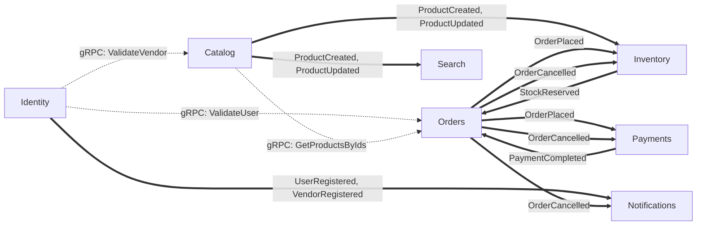
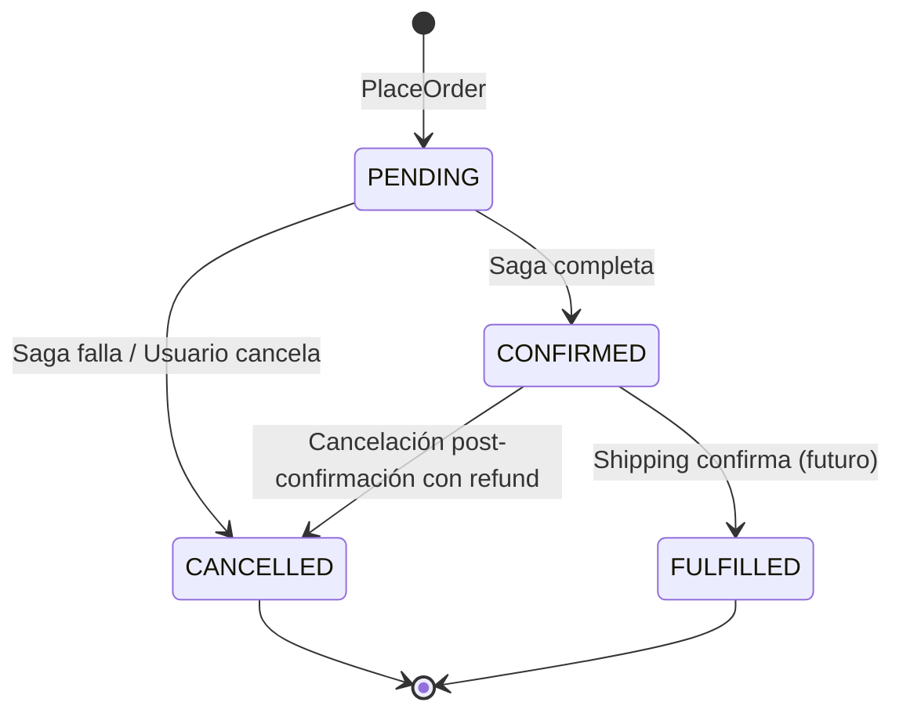
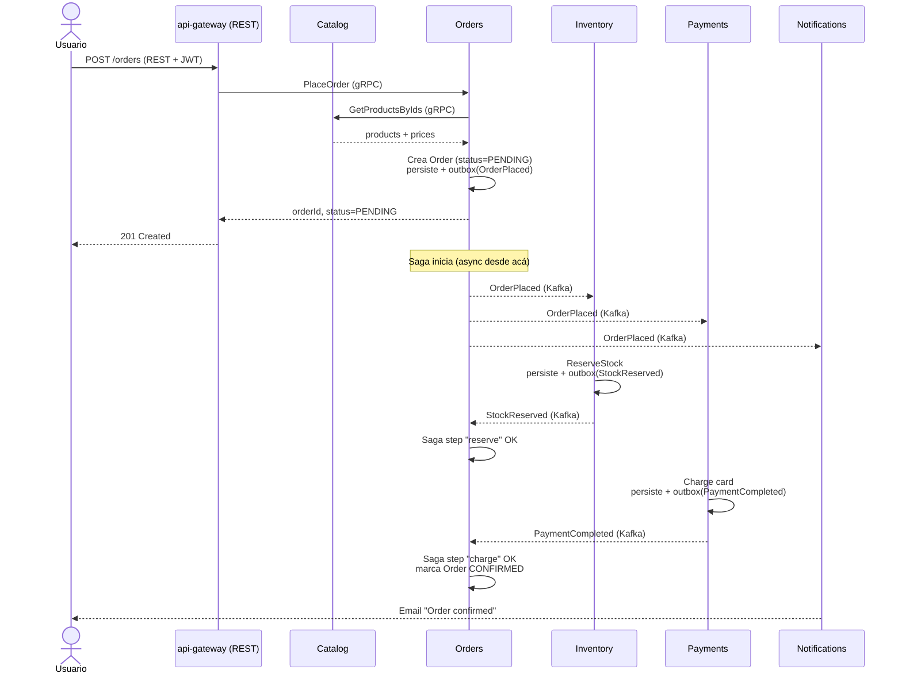
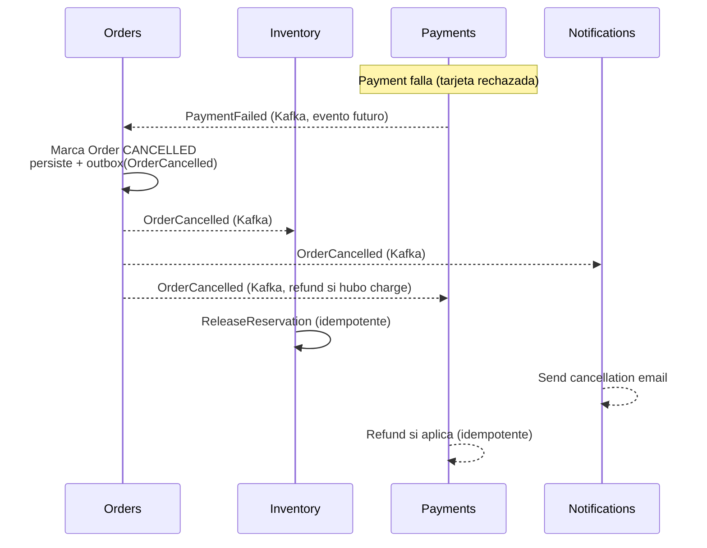

# Bounded Contexts y Eventos Canónicos

## Propósito

Este documento define los **bounded contexts** centrales del proyecto Melown y los **eventos canónicos** que cruzan sus fronteras. Es el resultado de un Event Storming light enfocado en el flujo central de un marketplace e-commerce.

**Qué es:**
- Una baseline trabajable para decidir qué `.proto` (gRPC) y qué `.avsc` (Kafka/Avro) escribir primero.
- Un mapa mental para razonar sobre dónde vive cada pieza del dominio.
- Un documento **vivo** — se refina a medida que el modelo choca con la realidad en Fase 1+.

**Qué NO es:**
- Un modelo final ni una especificación cerrada.
- Una lista exhaustiva de todos los eventos del sistema (solo los del flujo central están acá).
- Un sustituto de los ADRs — los ADRs deciden políticas/patrones; este documento describe estructura del dominio.

**Alcance del primer pase:** 4 contextos centrales (Catalog, Identity, Inventory, Orders) y 8 eventos canónicos. Cart, Payments, Shipping, Notifications, Search, Pricing y Reviews quedan fuera de este primer pase — aparecen mencionados como consumers/productores pero su modelado de dominio se posterga.

---

## Mapa de contextos

Líneas sólidas (`==>`) son eventos asíncronos vía Kafka. Líneas punteadas (`-->`) son llamadas síncronas vía gRPC.

**Relaciones DDD entre contextos** (en lenguaje de Eric Evans):

| Upstream | Downstream | Tipo de relación |
|---|---|---|
| Identity | Catalog | Customer-Supplier (Catalog necesita validar vendors) |
| Identity | Orders | Customer-Supplier (Orders necesita validar users) |
| Catalog | Orders | Customer-Supplier (Orders consulta productos y precios en checkout) |
| Catalog | Search | Conformist (Search consume eventos read-only, no influye en Catalog) |
| Catalog | Inventory | Customer-Supplier vía eventos (Inventory crea SKU al ver ProductCreated) |
| Orders | Inventory | Customer-Supplier bidireccional (Orders pide reservas, Inventory confirma con StockReserved) |
| Orders | Payments | Customer-Supplier bidireccional |

---

## Contextos

### Catalog

**Responsabilidad:** Catálogo de productos. Los vendors crean y actualizan sus productos; el sistema los publica como source-of-truth.

**Aggregates owned:**

- `Product` (aggregate root)
  - Campos clave: `productId` (UUID), `vendorId` (FK opaca a Identity), `title`, `description`, `categoryId`, `attributes` (Map<String,String>), `basePrice` (Money), `status` (`DRAFT` | `ACTIVE` | `INACTIVE`), `version` (optimistic lock), `createdAt`, `updatedAt`.
- `Category` (aggregate root)
  - Campos clave: `categoryId`, `name`, `parentCategoryId` (nullable), `slug`.

**Comandos aceptados** (vía gRPC):

- `CreateProduct` (vendor-issued).
- `UpdateProduct`.
- `DeleteProduct` (soft delete → `status = INACTIVE`).
- `GetProductById` (query).
- `GetProductsByIds` (query, usado por Orders en checkout).
- `ListProductsByVendor` (query).

**Eventos publicados:** `ProductCreated`, `ProductUpdated`.

**Eventos consumidos:** ninguno en el primer pase. Catalog valida vendors vía gRPC sync contra Identity al momento de crear. Si en el futuro queremos cache local de vendors, se consume `VendorRegistered`/`VendorApproved`.

**DB owned:** PostgreSQL `catalog_db`.

**Invariantes principales:**

- Un `Product` solo puede crearse si el `vendorId` existe en Identity con `status = APPROVED` (validación sync vía gRPC al borde, no en dominio).
- `title` mandatory, ≤ 200 chars.
- `basePrice.amount ≥ 0`.
- Transiciones de status: `DRAFT → ACTIVE → INACTIVE`; `ACTIVE ↔ INACTIVE` permitido; no se vuelve a `DRAFT` una vez activado.

---

### Identity

**Responsabilidad:** Identidad de usuarios y vendors. Autenticación (OAuth2/OIDC, JWT, refresh tokens — el cómo se decide en ADR pendiente sobre auth). Autorización (roles, scopes).

**Aggregates owned:**

- `User` (aggregate root)
  - Campos clave: `userId` (UUID), `email`, `hashedPassword`, `status` (`PENDING` | `ACTIVE` | `SUSPENDED`), `roles` (Set<Role>), `createdAt`.
- `Vendor` (aggregate root, separado de User pero linkeado)
  - Campos clave: `vendorId` (UUID), `userId` (FK a User), `businessName`, `taxId`, `status` (`PENDING_APPROVAL` | `APPROVED` | `REJECTED`), `createdAt`.

Nota: `User` y `Vendor` son agregados distintos. Un User puede ser solo comprador; si quiere vender, se registra adicionalmente como Vendor (1-a-1 o 1-a-muchos según política — primer pase: 1-a-1).

**Comandos aceptados:**

- `RegisterUser`.
- `RegisterVendor` (requiere User existente y `ACTIVE`).
- `ApproveVendor` (admin-issued — modelado pero no expuesto al gateway todavía).
- `Authenticate` (returns access token + refresh token).
- `RefreshToken`.

**Eventos publicados:** `UserRegistered`, `VendorRegistered`. (Futuros: `UserActivated`, `VendorApproved`, `UserSuspended`.)

**Eventos consumidos:** ninguno en el primer pase.

**DB owned:** PostgreSQL `identity_db`.

**Invariantes principales:**

- `email` único globalmente (constraint en DB).
- Password siempre hasheado antes de persistir (algoritmo decidido en ADR pendiente de auth).
- Un `User` debe estar `ACTIVE` para registrar un `Vendor`.
- `Vendor.status` arranca en `PENDING_APPROVAL`; solo `ApproveVendor` (admin) lo mueve a `APPROVED`.

---

### Inventory

**Responsabilidad:** Stock por SKU por warehouse. Gestiona reservas (holds temporales durante checkout), confirmaciones (al concretarse la compra) y liberaciones (compensación de Saga).

**Aggregates owned:**

- `StockItem` (aggregate root, identidad compuesta: `sku + warehouseId`)
  - Campos clave: `sku`, `warehouseId`, `productId`, `availableQuantity`, `reservedQuantity`, `version` (optimistic lock).
- `Reservation` (aggregate root)
  - Campos clave: `reservationId` (UUID), `sku`, `warehouseId`, `quantity`, `orderId`, `status` (`RESERVED` | `CONFIRMED` | `RELEASED`), `expiresAt`, `createdAt`.

**Comandos aceptados:**

- `IncreaseStock` (admin/vendor).
- `DecreaseStock` (admin).
- `ReserveStock` (called by Orders durante checkout — sync gRPC para feedback inmediato).
- `ConfirmReservation` (called by Orders cuando el pago es exitoso — puede ser sync o vía evento; primer pase: sync).
- `ReleaseReservation` (called by Orders en cancelación; también via consumir `OrderCancelled`).
- `GetStockBySku` (query).

**Eventos publicados:** `StockReserved`.

**Eventos consumidos:**

- `ProductCreated` → crea automáticamente un `StockItem` con `availableQuantity = 0` para todos los warehouses.
- `OrderCancelled` → libera la `Reservation` asociada si todavía no fue confirmada.

**DB owned:** PostgreSQL `inventory_db`.

**Invariantes principales:**

- `availableQuantity + reservedQuantity = totalQuantity` (invariante por StockItem).
- `availableQuantity ≥ 0` y `reservedQuantity ≥ 0`.
- Una `Reservation` solo se puede confirmar si su `status = RESERVED`.
- Una `Reservation` `RELEASED` no se puede confirmar.
- Reservas con `expiresAt` en el pasado se liberan automáticamente (job periódico — fuera de scope del primer pase pero modelado).
- Concurrencia: cuando dos pedidos compiten por el último ítem, optimistic locking (`version`) hace que uno gane y el otro retorne `ConflictException`.

---

### Orders

**Responsabilidad:** Lifecycle de la orden. **Orquestador de la Saga** que coordina Catalog (validación + precio), Inventory (reserva), Payments (cobro) y Shipping (booking). La pieza con más complejidad de dominio del proyecto.

**Aggregates owned:**

- `Order` (aggregate root)
  - Campos clave: `orderId` (UUID), `userId`, `items` (List<OrderItem>), `totalAmount` (Money), `status` (`PENDING` | `CONFIRMED` | `CANCELLED` | `FULFILLED`), `idempotencyKey` (cliente-provisto), `createdAt`, `updatedAt`, `version`.
  - `OrderItem` (entity interna): `sku`, `productId`, `quantity`, `unitPrice` (Money).
- `SagaState` (aggregate interno por Order, o conceptualmente embebido)
  - Campos clave: `orderId`, `currentStep`, `completedSteps` (Set), `compensationStarted` (bool), `failureReason` (nullable).

**Comandos aceptados:**

- `PlaceOrder` (user-issued vía gateway; incluye `idempotencyKey`).
- `CancelOrder` (user-issued o saga-driven internamente).
- `GetOrder` (query).
- `ListUserOrders` (query).

**Eventos publicados:** `OrderPlaced`, `OrderCancelled`. (Futuros: `OrderConfirmed`, `OrderFulfilled`.)

**Eventos consumidos:**

- `StockReserved` → marca el step "reserve" como completed en la Saga; avanza al siguiente step.
- `PaymentCompleted` → marca el step "charge" como completed; si todos los steps están completos, marca el Order como `CONFIRMED`.
- (Futuros, para fallos: `PaymentFailed`, `StockReservationFailed` → disparan compensación.)

**DB owned:** PostgreSQL `orders_db`.

**Invariantes principales:**

- Transiciones de status: `PENDING → CONFIRMED` (todos los Saga steps OK), `PENDING → CANCELLED` (compensación o usuario), `CONFIRMED → FULFILLED` (shipping confirma — futuro), `CONFIRMED → CANCELLED` (cancelación post-confirmación con refund).
- Un Order `CANCELLED` nunca vuelve a otro estado.
- Todos los items deben referenciar productos existentes y activos (validado sync vs Catalog en `PlaceOrder`).
- `idempotencyKey` única por usuario — reintento del mismo command con la misma key devuelve el Order existente.
- `totalAmount = sum(item.unitPrice × item.quantity)`.

**Diagrama de estados de `Order`:**

---

## Eventos canónicos (catálogo)

Por cada evento: qué representa, payload conceptual (sin Avro todavía — eso lo deciden los `.avsc` en `:contracts:<service>:avro`), garantías de orden, y cómo se asegura la idempotencia en el consumer.

Todos los eventos comparten un envelope mínimo: `eventId` (UUID, único), `occurredAt` (timestamp ISO 8601), `producer` (nombre del servicio). Los consumers deben deduplicar por `eventId`.

---

### 1. `UserRegistered`

- **Productor:** Identity.
- **Consumers (actuales/planeados):** Notifications (welcome email), Analytics (futuro), AdminWorkflow (futuro).
- **Payload conceptual:** `{ eventId, userId, email, occurredAt }`. (Sin password, sin PII innecesaria.)
- **Garantía de orden:** at-least-once, ordering por `userId` (partition key = `userId`).
- **Idempotencia en consumer:** deduplicar por `eventId`. Notifications no debe mandar welcome email dos veces si el evento llega duplicado.

### 2. `VendorRegistered`

- **Productor:** Identity.
- **Consumers:** Notifications, AdminWorkflow (futuro), Catalog (futuro, para cache local de vendors si lo introducimos).
- **Payload conceptual:** `{ eventId, vendorId, userId, businessName, occurredAt }`.
- **Garantía de orden:** at-least-once, partition key = `vendorId`.
- **Idempotencia:** deduplicar por `eventId`.

### 3. `ProductCreated`

- **Productor:** Catalog.
- **Consumers:** Search (indexer crea documento), Inventory (crea `StockItem` con `availableQuantity = 0`).
- **Payload conceptual:** `{ eventId, productId, vendorId, title, basePrice, status, occurredAt }`.
- **Garantía de orden:** at-least-once, partition key = `productId`.
- **Idempotencia:** Search re-indexa siempre overwrite (idempotente por naturaleza). Inventory usa `(productId, warehouseId)` como clave única — segundo evento no crea SKU duplicado.

### 4. `ProductUpdated`

- **Productor:** Catalog.
- **Consumers:** Search (re-index).
- **Payload conceptual:** `{ eventId, productId, version, changes, occurredAt }`. El campo `changes` puede ser snapshot completo o delta (decisión diferida; primer pase: snapshot por simplicidad).
- **Garantía de orden:** at-least-once, partition key = `productId`.
- **Idempotencia:** Search descarta eventos con `version ≤` la versión ya indexada. Esto resuelve out-of-order y duplicados a la vez.

### 5. `StockReserved`

- **Productor:** Inventory.
- **Consumers:** Orders (continuación de Saga).
- **Payload conceptual:** `{ eventId, reservationId, sku, warehouseId, quantity, orderId, occurredAt }`.
- **Garantía de orden:** at-least-once, partition key = `orderId` (no `sku`, porque queremos que Orders procese los reservation events del mismo orderId en orden).
- **Idempotencia:** Orders usa `reservationId` como clave; si ya marcó esa reservation como received, ignora.

### 6. `OrderPlaced`

- **Productor:** Orders.
- **Consumers:** Payments (initiate charge), Inventory (reserve stock — alternativamente sync, decisión pendiente), Notifications (confirmation preliminar), Shipping (preliminary booking — futuro).
- **Payload conceptual:** `{ eventId, orderId, userId, items[], totalAmount, idempotencyKey, occurredAt }`.
- **Garantía de orden:** at-least-once, partition key = `orderId`.
- **Idempotencia:** cada consumer usa `orderId` como clave. Payments con la misma `orderId` no cobra dos veces.

### 7. `PaymentCompleted`

- **Productor:** Payments.
- **Consumers:** Orders (avanzar Saga), Notifications (recibo de pago).
- **Payload conceptual:** `{ eventId, paymentId, orderId, amount, currency, occurredAt }`.
- **Garantía de orden:** at-least-once, partition key = `orderId`.
- **Idempotencia:** Orders usa `paymentId` (no `eventId`) como clave de negocio — si recibe dos eventos con el mismo `paymentId`, segundo es ignorado.

### 8. `OrderCancelled`

- **Productor:** Orders.
- **Consumers:** Inventory (libera reservation), Notifications (cancellation email), Payments (refund si ya cobrado).
- **Payload conceptual:** `{ eventId, orderId, reason, cancellationId, occurredAt }`. `reason` es un enum: `USER_INITIATED` | `PAYMENT_FAILED` | `STOCK_UNAVAILABLE` | `TIMEOUT` | `ADMIN`.
- **Garantía de orden:** at-least-once, partition key = `orderId`.
- **Idempotencia:** Inventory usa `cancellationId` como clave; Payments idem para no hacer refunds duplicados.

---

## Flujo end-to-end (happy path)

Un usuario navega el catálogo y compra un producto. El pago es exitoso y la orden queda confirmada.

---

## Flujo de compensación (cancelación por fallo en la Saga)

El pago falla; la Saga compensa: libera el stock reservado y notifica al usuario.

---

## Decisiones diferidas

Cosas que sé que faltan o que vamos a refinar más adelante. Las dejo explícitas para que no se pierdan:

- **Modelado de Cart, Pricing, Reviews, Notifications, Search como bounded contexts propios.** Acá aparecen como consumers/productores pero su modelado interno (aggregates, comandos, eventos propios) se posterga.
- **`PaymentFailed`, `StockReservationFailed`, `ShippingBooked`, `OrderConfirmed`, `OrderFulfilled`.** Eventos que la Saga necesita pero todavía no están en el catálogo canónico. Se agregan cuando lleguemos a Fase 3.
- **`Cart` como aggregate aparte vs items embebidos en `Order`.** Primer pase: Cart no se modela (Phase 1-2 no lo necesita; cliente arma el array de items y manda a `PlaceOrder` directo). Phase 3+ se revisa.
- **Política de versionado de eventos Avro.** Cómo evoluciona un evento sin romper consumers. Lo bordea ADR `0001` (Avro + Schema Registry con `BACKWARD`), pero falta documentar el playbook concreto (qué cambios son backward-compatible, cómo se introduce un campo, cuándo se retira uno).
- **Snapshot vs delta en `ProductUpdated`.** Primer pase asume snapshot completo; si los productos crecen mucho, evaluar delta.
- **Outbox concreto (cómo se implementa).** Ya es regla dura en `CLAUDE.md`, falta ADR formal — probablemente outbox table polled by Debezium → Kafka, pero la decisión se formaliza por separado.
- **Auth concreta** (Spring Authorization Server embebido vs JWT custom con Nimbus): ADR pendiente.
- **Sincrónico vs asíncrono para `ReserveStock`** desde Orders. Acá lo modelé dual (Orders publica `OrderPlaced` y Inventory consume, **o** Orders llama sync gRPC). En Phase 3 se elige uno explícitamente.
- **Cómo se modela el `ApproveVendor` workflow** (admin tool, command-driven, evento `VendorApproved`). Phase 2-3 cuando aparezca el admin context.
- **Lock optimista vs pesimista** en `Reservation` de Inventory. Primer pase: optimista vía `version`. Si aparece contención muy alta en pruebas, revisar.
